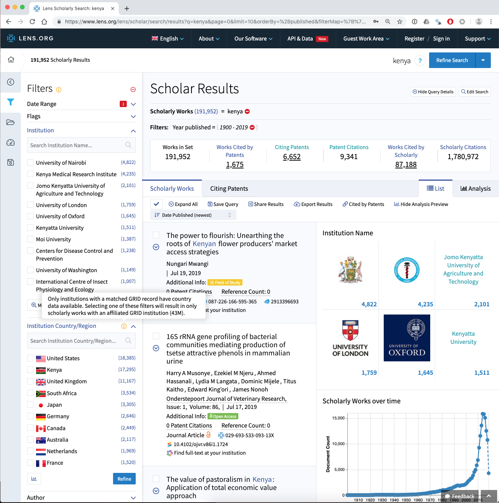

```{r setup, include=FALSE}
knitr::opts_chunk$set(echo = TRUE, cache = TRUE)
```

Kenlit is a dataset of open access data for scientific publications from or about Kenya. 

Kenlit was created using two sources:

1. Microsoft Academic Graph, for publications from organisations in Kenya
2. The Lens [https://www.lens.org/](https://www.lens.org/) database of scientific and patent literature, for any scientific literature mentioning Kenya. 

The idea behind Kenlit is to capture the universe of scientific publications from or mentioning Kenya. It is deliberately rough and ready to allow for refinement and for use in data science workshops. 

### The Lens

The Lens provides access to data from over 190 million scientific publications. To create the general data for Kenya (see lens.csv or lens.rda) a simple search for the word Kenya was carried out across all fields in the Lens. At the time when Kenlit was created this led to 176,335 results. This had increased to 191,952 as of the end of July 2019. We can see the search results from July 29th 2019 below.

```{r lens_result, echo=FALSE}
knitr::include_graphics("images/kenya_lens.png")
```

The Lens includes data from a range of different sources inclucing Microsoft Academic Graph, Crossref, PubMed, Core and PubMed Central. We can clearly see above that the dominant data source is Microsoft Academic Graph. 

This search of the Lens is _noisy_ because it will capture irrelevant results. 

1. It includes searches of the organisation and author fields. This means that the data will need to be cleaned for example to exclude authors with the surname Kenya. 
2. It includes searches of the full texts of publications from the Core database [https://core.ac.uk/](https://core.ac.uk/) of open access full text publications. This improves data capture for Kenya but it will also capture passing references to Kenya where the only reference to Kenya is in the bibliography.

For the purpose of creating Kenlit this is fine as the aim is to capture the universe of things that come from or refer to Kenya. However, in later analysis it will be important to clean this data, for example by filtering out the name Kenya in author fields. 

Data from the Lens presently has the important limitation that the author affiliation data (Institutions) are not avaialble for download with the other data. However, investigation of the affiliation data reveals additional issues as can be seen in the image below. 


```{r lens_institutions, echo=FALSE}

```

In considering this image note that the affiliation data, which comes from Microsoft Academic Graph, is limited in its coverarge producing the problem of missing data. Also note that in the Lens and in Kenlit, the affiliation data is limited to those organisations that appear in the Global Research Identifier Database (GRID). GRID addresses the problem of variations in the name of institutions but presently covers 99,000 organisations worldwide and is a work in progress. 

So for affiliation data we have two sources of missingness:

1. Records where affiliation data is missing from the record
2. Records where affiliation data is present but is not included in the GRID database at the moment. 

To create the Lens data in Kenlit the strategy used was to create a set of date limited collections with upto 50,000 records (a free account is required to create collections). These were downloaded and combined together into one table (lens.rda in the package and lens.csv in the zip archive).

Following the creation of Kenlit, the Lens released a free public Scholarly API [https://www.lens.org/lens/user/subscriptions](https://www.lens.org/lens/user/subscriptions). In future work the API will be used to update and refine Kenlit. 

### Microsoft Academic Graph

[Microsoft Academic Graph](https://www.microsoft.com/en-us/research/project/microsoft-academic-graph/)) is a graph of scientific publications indexed by the Bing search engine that can be accessed through [Microsoft Academic](https://academic.microsoft.com/home), through an API [https://docs.microsoft.com/en-us/azure/cognitive-services/academic-knowledge/home](https://docs.microsoft.com/en-us/azure/cognitive-services/academic-knowledge/home) or as a set of relational database tables available on request from Microsoft Academic in an [Azure Storage Blob](https://docs.microsoft.com/en-us/academic-services/graph/samples-azure-data-lake-analytics).

The data tables contain over 100 million records and are most suitable to users comfortable with using data at scale and with SQL.Microsoft provides guidance of set up with Azure Data Lake Analytics, but as we did not expect to use MAG all the time we took a different approach. This involved creating a Databricks Apache Spark cluster on Azure (which is easy to set up) and importing the tables onto the cluster. To work with the tables we used the option to add RStudio on the master node of the cluster and then created table joins using `sparklyr` in R before exporting the data.

MAG provides a straightforward data schema whereby different tables are linked using the `paperid` field as the primary key (Microsoft Academic in the Lens). The paperid field along with the affiliationid, authorid and fieldsofstudyid allow for table joins to be performed. The [schema](https://docs.microsoft.com/en-us/academic-services/graph/reference-data-schema) for joins is displayed below. 

```{r schema, echo=FALSE}
knitr::include_graphics("~/vignettes/images/entity-relationship-diagram.png")
```

The focus in using MAG on the cluster was identifying publications originating from Kenyan research organisations. 

To do this two initial steps were taken

1. The Affiliations table from MAG (january 2019) was imported into R
2. The February 2019 release of the GRID database was imported into R
3. The two tables were joined to create an `affiliations_grid` table

```{r eval=FALSE}
# import the MAG affiliations table
library(readr)
affiliations <- read_delim("Affiliations.txt", col_names = c("affiliationid", "rankno",
"normalizedname", 
"displayname", 
"grid_id",
"officialpage",
"wikipage",
"papercount",
"citationcount", 
"createddate"),                                                             
delim = "\t", escape_double = FALSE, trim_ws = TRUE)

# import GRID name and address table

grid_name_address <- read_csv("~/grid/grid_name_address.csv")

# join the tables retaining all he data in affiliations and 
# adding the GRID data where available
affiliations_grid <- left_join(affiliations, grid_name_address, by = "grid_id") %>% 
  select(-email_address, -line_1, -line_2, - line_3)

# save to disk
write_csv(affiliations_grid, "affiliations_grid.csv")
```


On the cluster the next step was to create the table joins to retrieve the publications linked to the affiliations using the `affiliationid` column,


```{r eval=FALSE}
library(sparklyr)
library(dplyr)

# on the cluster
# filter the data to Kenya 

kenya <- affiliations_grid %>% filter(country_code == "KE")

# join to the affiliation paperss and paper tables retaining only shared data (using inner join)

kenya_affiliations_papers <- inner_join(kenya, affiliations_papers, by = "affiliationid") %>% 
  inner_join(., papers, by = "paperid")
```

We then follow the same procedure for the fields of study and the authors

```{r eval=FALSE}
# join the authors to to affiliation data

kenya_papers_authors <- dplyr::inner_join(kenya_affiliations_papers, authors, by = "authorid")

# join the fields of study table

kenya_fosid <- inner_join(kenya_affiliations_papers_unique, fos_papers, by = "paperid")
```

The files are then written to the Dababricks cluster file system (DBFS) in parquet format, downloaded using the Databricks Client in the terminal and imported to write to a csv file. 

```{r eval=FALSE}
# on the clusterwrite to the Data Bricks file system
spark_write_table(kenya_papers_authors, "kenya_papers_authors_spark_tbl")
```

Read the files back into R locally

```{r eval=FALSE}
library(sparklyr)

# read in the parquet files
spark_read_parquet(sc, "kenya_papers_authors", "kenya_papers_authors_spark_tbl")

# create a table
kenya_authors_tbl <- tbl(sc, "kenya_papers_authors")


# collect into an object in the local environment (not as a Spark table)
kenya_authors <- collect(kenya_authors_tbl)

# write to file as normal

write_csv(kenya_authors, "kenya_authors.csv")
```

In kenlit, the filenames are simplified to authors, affiliations, papers and fos.

### Adding Data to the Lens dataset

As noted above the data from the Lens did not include the affiliation data. However, affiliation data can be retrieved directly from MAG using the microsoft academic id from the Lens which is the MAG paperid as the key.
